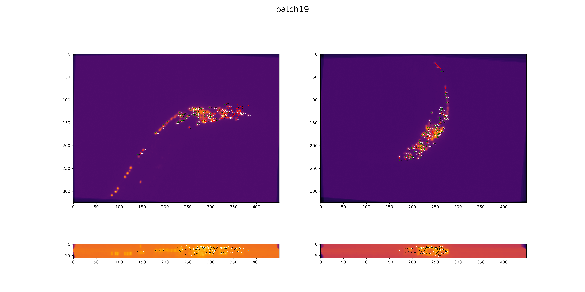

# neuron tracking of worms
freely moving whole brain imaging of c. elegans using deep learning

run using:
`python start.py --model_type UNet3D --batch_size 20 --n_channels 10 --n_bottleneck_feature_maps 3 --pixel_loss_ratio 7`

